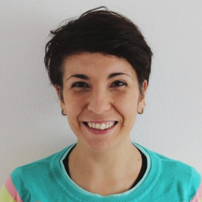
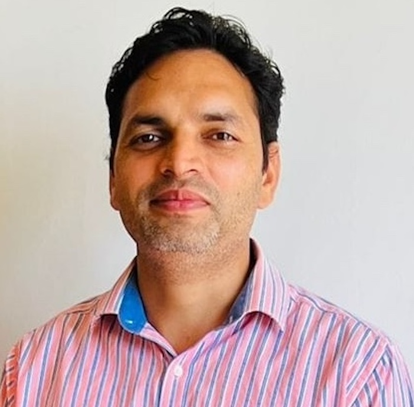

## Welcome

:::: {.layout-grid}

::: {.col}
::: {.card}

Expert

### **Name** $\cdot$ []()
:::
:::

::: {.col}
::: {.card}

Moderator

###  **Dr. Cecilia** $\cdot$ [](https://www.linkedin.com/in/cecilia-baldoni/)
:::
::: 

::: {.col}
::: {.card}

Presenter

### **Dr. Ajay Koli** $\cdot$ [](https://www.linkedin.com/in/ajay-kumar-koli/)
::: 
:::

::::

# Introduction {background-image="images/sara-logo-medium.png" background-size="15%" background-position="50% 15%"}

## {.centering .center}

::: {.columns}

::: {.column width="35%"}

{fig-alt="Sara's headshot" fig-align="center" width=250px style="border-radius: 50%;"}

#### Savitribai Phule (1831-1897) 🪷🙏🏽🪷

:::

::: {.column width="20%"}

 

:::

::: {.column width="35%"}

{fig-alt="Sara's headshot" fig-align="center" width=250px style="border-radius: 50%;"}

#### Ramabai Ambedkar (1898-1935) 🪷🙏🏽🪷

:::

[**Savitribai Ramabai (SARA) Institute of Data Science, Sonipat**]{.r-fit-text}

:::

## About SARA 

> Education for everyone

::: {.nonincremental}

- Est. April 2023

- Free^1^, open-source and inclusive education.

::: aside
^1^No tuition fee. Students pay only for their food and accommodation.
:::

:::

## SARA Data Schools

> Non-profit events $\cdot$ Offline $\cdot$ Sonipat (HR)

::: {.nonincremental}

1. SARA Summer School "R for Researchers"

1. SARA Winter School "Statistics using R"

1. SARA March Bootcamp "Publish using Quarto"

:::

## Bridge Courses {background-image="images/youtube.jpeg" background-position="85% 50%" background-size="25%"}

> Free $\cdot$  Online $\cdot$ Open to all

::: {.nonincremental}

- Live on [SARA YouTube Channel](https://www.youtube.com/@SARADataScience)

- For first-generation parents & students.

- Essential subjects like: 
  - Social Science
  - Science
  - Maths
  - Dalit Literature
  - General Knowledge etc.

:::

## SARA Updates {background-image="images/whatsapp.jpeg" background-position="right" background-size="contain"}

::: {.columns}

::: {.column width="50%"}

 
 

> WhatsApp Channel `+840` People

::: aside

[](https://bsky.app/profile/sarainstitute.bsky.social) &nbsp; [](https://github.com/sara-edu) &nbsp; [](https://www.instagram.com/sara_data_sci/) &nbsp; [](https://twitter.com/sara_institute) &nbsp; [](https://www.facebook.com/profile.php?id=61564043738390) &nbsp; [](https://www.youtube.com/@SARADataScience) &nbsp; [](https://www.linkedin.com/company/sara-institute/) &nbsp; [](https://whatsapp.com/channel/0029Va4r7rGLCoWycMwThl2J)

:::

:::

::: {.column}

:::

:::

## Donate to SARA {background-image="images/upi-sara.png" background-position="right" background-size="contain"}

::: {.columns}

::: {.column width="50%"}

 
 

::: {.nonincremental}
::: {.r-fit-text}

- Account Name: SARA EDUCATION TRUST

- Account Number: `42920911856`

- Bank Name: STATE BANK OF INDIA

- IFSC Code: `SBIN0000721`
:::

:::

:::

::: {.column}

:::

:::

## SARA Library {background-image="images/book-donation.png" background-position="right" background-size="contain"}

::: {.columns}

::: {.column}
> 40 Books for Bridge Course Level 1

 

Link: <https://sara-edu.netlify.app/book-club/books-donation/sara_book_donations>

:::

::: {.column}

:::

:::

## Sircle {background-image="images/sircle-logo-nobg.png" background-size="35%" background-position="90% 50%"}

> SARA Jai Bhim Circle

::: {.nonincremental}

- Quarterly online community meet-up

- To share success and receive guidance

- To share donation and expenses status

:::

## Contact SARA {background-image="images/sara-logo-medium.png" background-size="20%" background-position="90% 50%"}

::: {.columns }

::: {.column width="70%"}
::: {.r-fit-text}
** Address:** 
SARA Institute   
Dr. Ambedkar Bhavan, Near Dayanand Hospital            
Kakroi Road, Sonipat, Haryana - 131001, India       
Google Map Link: <https://maps.app.goo.gl/d9S6a3pEFNXhnJGN6>

 

** Phone:** +91 925 315 2024     
** Email:** [sara.institute.info@gmail.com](mailto:sara.institute.info@gmail.com)  
** Website:** <https://sara-edu.netlify.app/>

:::
:::

::: {.column width="25%" .center}
:::
:::

::: aside

[](https://bsky.app/profile/sarainstitute.bsky.social) &nbsp; [](https://github.com/sara-edu) &nbsp; [](https://www.instagram.com/sara_data_sci/) &nbsp; [](https://twitter.com/sara_institute) &nbsp; [](https://www.facebook.com/profile.php?id=61564043738390) &nbsp; [](https://www.youtube.com/@SARADataScience) &nbsp; [](https://www.linkedin.com/company/sara-institute/) &nbsp; [](https://whatsapp.com/channel/0029Va4r7rGLCoWycMwThl2J)

:::

# Book Title {background-color="#003366"}

**SARA Book Club**

<!-- TODO: replace with a cover-image title slide, e.g.
# Book Title {background-image="img/cover-titlebook.jpg" background-size="contain" background-position="right" background-color="#003366"}
-->

## About the Book

::::: columns
::: {.column width="55%"}
### Book Title

**Author:** Author Name

[Short synopsis placeholder, what the book covers, etc.]{.left}
:::

::: {.column width="45%"}
{fig-align="center" width="70%"}
:::
:::::

## About the Author

::::: columns
::: {.column width="30%"}
{width="80%" fig-align="center"}
:::

::: {.column width="70%"}
[Short author bio placeholder.]{.left}
:::
:::::

## Why This Book?

- Placeholder reason 1
- Placeholder reason 2
- Placeholder reason 3

## Discussion Questions

1. Placeholder question one.
2. Placeholder question two.
3. Placeholder question three.

## Key Takeaways

::: incremental
- Placeholder takeaway one
- Placeholder takeaway two
- Placeholder takeaway three
:::

## Resources

- [Book / author link placeholder](#)
- [Related article placeholder](#)
- [Watch the discussion recording](#)

## {background-color="#003366"}

::: centering
[Thank you!]{.theme-cursive style="font-size: 3em; color: white;"}

**SARA Book Club**
:::
